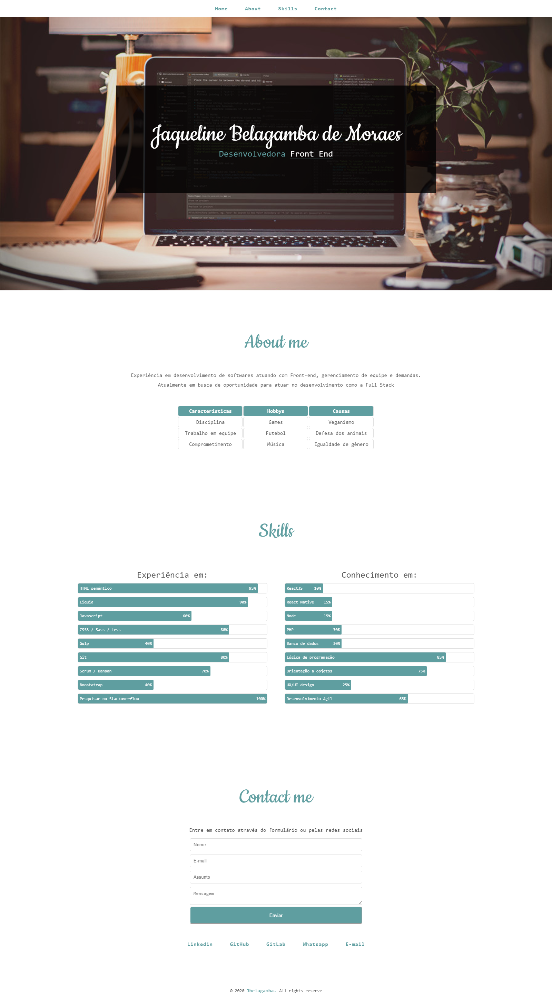

# Growdev | Exercicio aula 2

Desafio proposto:

Criar e estilizar página html com as seguintes tags:

- Título
- Texto
- Links
- Lista ordenada e não ordenada
- Tabela
- Utilização de cores

Resultado: 

